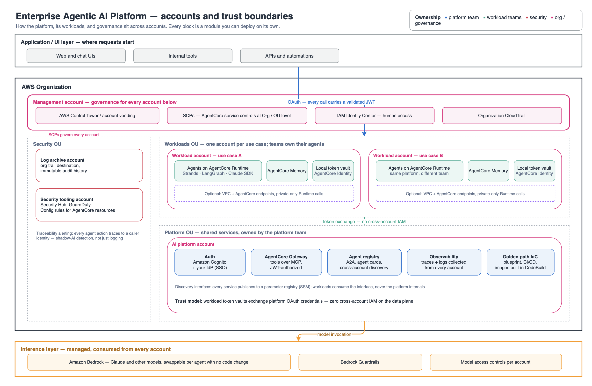

# Enterprise Agentic AI Platform Accelerator

Deploy a secure, governed foundation for production AI agents on Amazon Bedrock AgentCore. This **open-source, modular** project works as a self-service starter kit, a foundation to tailor to your environment, or a guided team build.

## What You Get

- **An AI platform for production agents:** AgentCore Runtime, Gateway, Identity, Memory, and observability.
- **Your choice of agent framework:** use Strands Agents, LangGraph, Claude Agent SDK, without rebuilding the infrastructure.
- **Security controls as you need them:** turn on VPC isolation, KMS encryption, CloudTrail, SCPs, Cedar policies, Bedrock Guardrails, resource policies, and traceability alerting.
- **A repeatable way to ship:** deploy by profile, team, module, or CI/CD. Then verify the result with the included scripts and local dashboard.

> **Security details:** See [`docs/SECURITY_CONTROLS.md`](docs/SECURITY_CONTROLS.md) for available controls and enablement guidance.

## How to use this accelerator

Use this five-step path to get from a starting point to a working deployment.

| Step | What you do | Where to start |
|------|-------------|----------------|
| 1 | Pick the deployment shape that fits your work | [Choose a profile](#choose-your-starting-point) |
| 2 | Check your account, tools, AWS Region, and expected costs | [Review prerequisites](#getting-started) |
| 3 | Deploy the profile, team, or module(s) you need | [Deploy the platform](#deploy) |
| 4 | Invoke the sample agent and check the gateway | [Verify the deployment](#test-the-deployment) |
| 5 | Follow rollout status while you work | [View deployed resources](#dashboard) |

> **Doing this as a workshop?** [`docs/PARTICIPANT_GUIDE.md`](docs/PARTICIPANT_GUIDE.md)
> walks the modules in order with expected timings and what proves each one worked.
> When something breaks, [`docs/TROUBLESHOOTING.md`](docs/TROUBLESHOOTING.md) is
> organised by symptom.


## Choose Your Starting Point

Pick the profile that looks most like your job today. It is a starting point, you can further customize your deployment later.

| Profile | Good fit when you are... | Scope (guided modules) |
|---------|--------------------------|------------------------|
| `greenfield` | Building new agents from scratch | Identity, gateway, one agent runtime, and observability |
| `migration` | Moving agents from EC2, ECS, or Lambda | Identity, runtime migration, gateway integration, and observability |
| `multi-agent` | Building specialist agents that work together | Gateway, orchestrator, A2A runtimes, and observability |
| `platform-team` | Setting up shared infrastructure for your organization | Full platform, including memory, A2A, networking, and security |
| `security-focused` | Starting with compliance and hardening | One-agent platform, networking, security, policy, egress, and traceability controls |

A profile is both a footprint and a lesson plan: `deploy --profile <name>` deploys the whole scope in one run, while `workshop --profile <name>` walks the same scope module by module. The exact stack list comes from the profile's preset ([`presets/`](presets/)); print it any time with `./scripts/deploy.sh ls`.


## Getting Started

### Prerequisites

Before you deploy:

- **AWS credentials:** permission to create IAM, Cognito, ECR, CodeBuild, Amazon Bedrock and Bedrock AgentCore resources. The deploy script validates them before making changes.
- **Bedrock model access:** enable access to the model your agents use (default: Anthropic Claude) in the Amazon Bedrock console, in the Region you deploy to. Deployment succeeds without it, but every agent invocation fails at runtime.
- **Local tooling:** Python 3.13 (as `python3.13`), Node.js/npm, the AWS CLI, and bash 4+ (macOS ships 3.2 — `brew install bash`). The script checks these and installs the AWS CDK CLI if it is missing. A container runtime is **not** required: agent images are built remotely in AWS CodeBuild, and it is only useful for testing an image locally.
- **Region:** pick a Region where AgentCore and your chosen Bedrock model are available. The default is `us-east-1`.
- **Cost awareness:** networking profiles create a NAT gateway and VPC endpoints with hourly billing. Enabling Transaction Search changes account-level span pricing. Tear down resources when you finish testing.

### Architecture

Want the full picture? Read [`docs/ARCHITECTURE.md`](docs/ARCHITECTURE.md) for the Mermaid diagram and request flows that the repository verifies end to end.



Applications sign in once and carry a validated JWT. Agents run in workload accounts, one per use case, owned by the teams that build them. The platform account holds the shared services, and cross-account trust is OAuth token exchange, with no cross-account IAM on the data plane. Governance and security tooling sit in their own accounts and apply to all of them.


The Mermaid diagram in [`docs/ARCHITECTURE.md`](docs/ARCHITECTURE.md) is the source of truth for the request flows, and it renders directly on GitHub.

### Deploy

Start with a profile. You can narrow the deployment by team or module later. Want a guided run? That is available too.

```bash
# 1. Install dependencies
python3.13 -m venv .venv && source .venv/bin/activate
pip install -r requirements.txt

# 2. Pick a profile and deploy it
./scripts/deploy.sh deploy --profile greenfield
# Other profiles: migration | multi-agent | platform-team | security-focused

# 3. Deploy a smaller scope instead
./scripts/deploy.sh deploy --team agent  # Agent team stacks only
./scripts/deploy.sh deploy --module 4    # Identity integration

# 4. Run a profile in CI/CD
NON_INTERACTIVE=1 AWS_REGION=us-east-1 ./scripts/deploy.sh deploy --profile platform-team

# 5. Use the guided run for explanations and checks after each module
# The script needs bash 4 or newer. macOS includes bash 3.2.
# Install a newer version with `brew install bash`, then run `bash scripts/deploy.sh ...`.
./scripts/deploy.sh workshop                        # Default profile: greenfield
./scripts/deploy.sh workshop --profile multi-agent  # Or migration|platform-team|security-focused
./scripts/deploy.sh workshop --from 6               # Resume at module 6
./scripts/deploy.sh workshop --dry-run              # Show the plan without AWS calls
```


## Test the Deployment

After deployment, run a few checks. They make it easier to spot a missing permission or a bad endpoint early.

```bash
export AWS_PROFILE=<your-profile>   # Skip if you use default credentials
# AWS_REGION is optional: the tools read the region you deployed with
# (platform.yaml or workshop.env). Set it only to override.

# Health check: runs every check your configuration promises (gateway, memory,
# observability, live agent invokes, ...) and exits non-zero on any failure.
./scripts/deploy.sh verify

# Invoke the deployed agent. Add --session <id> to continue a conversation.
# (Ask the default orchestrator about its role, not its tools — it delegates
# to sub-agents and deliberately has none of its own.)
python scripts/invoke.py "Hello! What kinds of tasks can you help with?"

# Use the AG-UI protocol for agui-* patterns.
python scripts/invoke.py --agui "Hello! What kinds of tasks can you help with?"

# List the gateway's MCP tools.
python scripts/invoke.py --tools

# Call the gateway directly: MCP tools/list and one tools/call.
python scripts/test_gateway.py
```

For the wider test plan, read [`docs/TESTING.md`](docs/TESTING.md). For live resource status, use the [Dashboard](#dashboard).

## Dashboard

Want to see the platform come together? The local dashboard shows deployment status and a
short explanation of the pieces you are deploying. It runs on your machine and polls the
resources in your AWS account.

Run both commands from the repository root. The dashboard is only available on localhost.

```bash
# Terminal 1: poller. Writes dashboard/public/status.json every 15 seconds.
# Polls the region you deployed with; set AWS_REGION only to override.
AWS_PROFILE=<your-profile> .venv/bin/python dashboard/monitor.py

# Terminal 2: web server. Open http://localhost:8888.
python3 -m http.server 8888 -d dashboard/public
```


## Clean Up

Destroy resources when you no longer need them

```bash
./scripts/deploy.sh destroy

# Or destroy one stack.
./scripts/deploy.sh destroy --stack <stack-name>
```

For networking deployments, AgentCore network interfaces can outlive a runtime for up to eight hours. A cleanup may need a retry. See [Network isolation](#run-runtimes-in-your-vpc-enable_networking) for the detail.


## Understand the AWS CloudFormation Stacks

### Stacks

Profiles select from these stack building blocks.

| Stack | Resources | What it does |
|-------|-----------|--------------|
| `auth` | Cognito User Pool, 3 clients, SSM params | Sets up identity with optional federated IdP support |
| `identity` | OAuth2 credential providers | Supports 3LO delegation for Google, GitHub, and Notion |
| `memory` | CfnMemory + strategies | Adds semantic and user-preference memory |
| `gateway` | CfnGateway + Lambda targets | Exposes MCP tools with CUSTOM_JWT auth |
| `runtime-orchestrator` | ECR, CodeBuild, CfnRuntime | Runs the main HTTP agent |
| `runtime-code-agent` | ECR, CodeBuild, CfnRuntime | Runs an A2A sub-agent for code tasks |
| `runtime-research-agent` | ECR, CodeBuild, CfnRuntime | Runs an A2A sub-agent for research |
| `observability` | Vended logs, X-Ray delivery | Collects monitoring data for each resource |
| `networking` *(optional)* | VPC, private subnets, endpoints, runtime SG | Puts agents in your VPC ([details](#run-runtimes-in-your-vpc-enable_networking)) |
| `security` *(optional)* | KMS CMK, CloudTrail | Adds security hardening |

## Customize, Operate, and Extend

Use these sections when you need to change how the platform is deployed, secured, monitored, or integrated. The main entry points:

| You want to... | Start here |
|----------------|------------|
| Configure the platform declaratively | [`platform.yaml`](#customize-a-deployment), starting from a preset in [`presets/`](presets/) |
| Use your corporate IdP (Entra ID, Okta, Ping) | [`docs/ENTERPRISE_IDP.md`](docs/ENTERPRISE_IDP.md) |
| Deploy across multiple accounts (federated) | [`docs/MULTI_ACCOUNT.md`](docs/MULTI_ACCOUNT.md) |
| Add your own tools to the gateway | [`docs/GATEWAY_TARGETS.md`](docs/GATEWAY_TARGETS.md) |
| Build a use case on top of the platform | [`CONTRIBUTING_USE_CASES.md`](CONTRIBUTING_USE_CASES.md) with [`docs/PLATFORM_INTERFACE.md`](docs/PLATFORM_INTERFACE.md) |

### Choose an Agent Framework
Each runtime stack builds one agent from the `agent-code/` directory. Pick the framework you want here; the CDK infrastructure does not change.

Available patterns: `orchestrator` (default), `strands-agent`, `langgraph-agent`, `claude-sdk-agent`, `claude-sdk-multi-agent`, `agui-strands-agent`, and `agui-langgraph-agent`. A bad value stops the deployment before it starts.

```bash
# Pick a framework. The script saves the choice in workshop.env for later runs.
AGENT_PATTERN=langgraph-agent ./scripts/deploy.sh deploy --module 6

# Or pass it to CDK directly.
cdk deploy agentcore-workshop-dev-runtime-orchestrator -c agent_pattern=claude-sdk-agent
```

`./scripts/deploy.sh deploy` asks for the pattern in an interactive run. The guided command prints the active pattern before its first module.

The agent applications and shared utilities build on patterns from [fullstack-solution-template-for-agentcore](https://github.com/aws-samples/fullstack-solution-template-for-agentcore) (FAST). The CDK stacks are specific to this accelerator.

### Track Costs per Component

Every stack is tagged with `Project`, `Environment`, and `Component` (the stack's suffix in the deployment contract — `gateway`, `memory`, `runtime-orchestrator`, use-case stacks included). To see them in Cost Explorer, activate the tags once per payer account — takes effect within about 24 hours:

```bash
aws ce update-cost-allocation-tags-status --cost-allocation-tags-status \
  Status=Active,TagKey=Project Status=Active,TagKey=Environment Status=Active,TagKey=Component
```

Then group by the `Component` tag in Cost Explorer to split spend per stack. Scope: tags attribute *resource* costs (NAT, endpoints, CloudWatch, CodeBuild). Two gaps to know about: a few resource types (AgentCore Memory, SSM parameters) do not accept CloudFormation tags, and Bedrock model inference — usually the largest line — is not covered by resource tags at all; attributing inference requires Application Inference Profiles, which is on the roadmap.

### Run Runtimes in Your VPC (`enable_networking`)

Use this when your agents need private access to resources in your VPC or tighter outbound network controls. Set `enable_networking=true` to run runtimes in your VPC. AgentCore creates network interfaces in private subnets and attaches them to a security group with HTTPS-only egress and no inbound access. Traffic goes out through the NAT gateway. Interface endpoints cover Bedrock, ECR, CloudWatch Logs, and AgentCore Gateway. ECR layer pulls use the free S3 gateway endpoint.

This is not an air-gapped VPC.

- **What you get:** no public network path from the agent, private access to resources in your VPC, and security-group control over destinations.
- **What you do not get:** the private subnets still have a NAT route because agents call AWS APIs and some patterns use the public internet. Remove the NAT only after adding endpoints for every service your agents call.

Do not trust the flag alone. After deploying, confirm the runtimes actually landed in private subnets:

```bash
python scripts/check_network.py                  # Supported subnets and runtimes in the VPC
python scripts/check_network.py --expect-public   # Deployments without networking
```

> **Availability Zones:** AgentCore supports VPC connectivity in selected AZs. An AZ name such as `us-east-1a` maps to a different AZ ID, such as `use1-az1`, in each account. A VPC that works in one account can still fail when another account creates a runtime. `check_network.py` catches that during the networking module. The guided command runs it as module C's verification.

> **Teardown:** network interfaces can remain for up to 8 hours after a runtime stops using VPC mode. During that window, deleting the networking stack can fail because the private subnets and runtime security group still have dependencies. The NAT gateway and VPC endpoints, which create the hourly charges, are deleted in the same run. Try the destroy again after the interfaces age out: `aws ec2 describe-network-interfaces --filters Name=interface-type,Values=agentic_ai`.

### Customize a Deployment

Use these settings to change the platform's name, environment, identity provider, optional capabilities, model, or agent framework. Set configuration with CDK context (`-c key=value`) or environment variables.

| Context key | Environment variable | Default | Meaning |
|-------------|----------------------|---------|---------|
| `project` | `PROJECT_NAME` | `agentcore-workshop` | Project identifier |
| `environment` | `ENVIRONMENT` | `dev` | Environment name |
| `region` | `AWS_REGION` | `us-east-1` | AWS Region |
| `idp_type` | `IDP_TYPE` | `cognito` | IdP: cognito/entra_id/okta/ping |
| `enable_networking` | `ENABLE_NETWORKING` | `false` | Create the VPC stack |
| `enable_security` | `ENABLE_SECURITY` | `false` | Create the security stack |
| `require_guardrails` | `REQUIRE_GUARDRAILS` | `false` | Deny Bedrock inference without a Guardrail on the runtime roles and inject a baseline guardrail into every agent (not supported by the claude-sdk patterns) |
| `enable_a2a` | `ENABLE_A2A` | `true` | Create A2A agent stacks |
| `model_id` | `MODEL_ID` | *(in code for each pattern)* | Override the Bedrock model for all agents, for example `us.anthropic.claude-sonnet-5` |
| `agents.allowed_models` | `ALLOWED_MODELS` | *(unrestricted)* | Optional model allow-list. When set, `model_id` must be one of these and the runtime role's Bedrock permissions are scoped to exactly these models |
| `agent_pattern` | `AGENT_PATTERN` | `orchestrator` | Pattern built for the runtime. See [Agent Pattern Selection](#choose-an-agent-framework). |
| `enable_transaction_search` | `ENABLE_TRANSACTION_SEARCH` | `true` | Configure CloudWatch Transaction Search. This setting is account scoped. See [details](#search-agent-traces). |

Prefer a file you can review and commit? `platform.yaml` is the declarative manifest for the same settings and more (multi-account strategy, gateway tools, security controls). Deploying with `--profile <name>` writes it for you from [`presets/`](presets/), or copy a preset yourself and validate it offline:

```bash
python -m infra_utils.platform_config platform.yaml
```

Interactive `./scripts/deploy.sh deploy` answers go into the gitignored `workshop.env` file and are used on later runs. Environment variables win over `platform.yaml`, which wins over `workshop.env`, which wins over defaults. Check the current values with `./scripts/deploy.sh config`. Start over with `./scripts/deploy.sh config --reset`.

Secrets such as an IdP client secret or API keys are never written to `workshop.env`. They go to AWS Secrets Manager.

### Verify Caller Identity

Agents identify callers from the JWT in the `Authorization` header, not the request body. See [`docs/IDENTITY.md`](docs/IDENTITY.md) for how token validation works and why the agent checks it twice.

### Search Agent Traces

Runtime traces won't appear until the account is configured to receive them. See [`docs/TRACING.md`](docs/TRACING.md) for the setup and verification steps.

### Extend the Platform with Other Stacks

New stacks can read values from the platform through SSM Parameter Store. Here are the paths available after deployment:

```
/{project}/{environment}/auth/issuer-url
/{project}/{environment}/auth/user-pool-id
/{project}/{environment}/auth/app-client-id
/{project}/{environment}/identity/gateway-credential-provider-name
/{project}/{environment}/gateway/url
/{project}/{environment}/memory/memory-id
/{project}/{environment}/runtimes/{component}/arn
```
