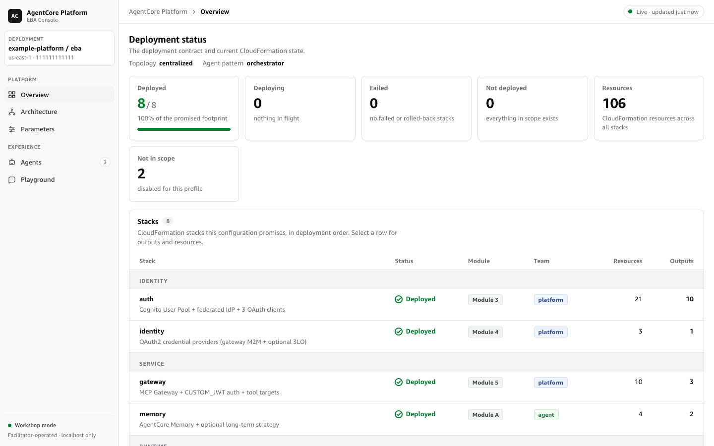
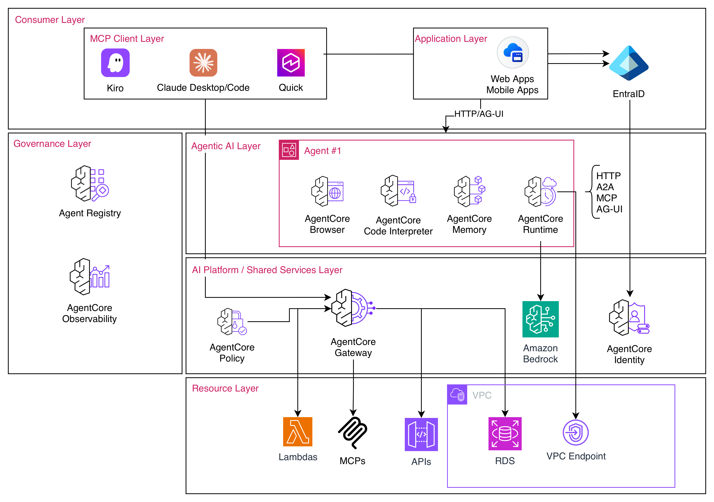

# AgentCore Workshop CDK Platform

Modular AWS CDK (Python) infrastructure for the **AgentCore Platform and Security Accelerator** 2-day workshop.

> **Security controls:** opt-in SCPs, VPC endpoint / IAM policies, Cedar policies, resource
> policies, Bedrock Guardrails + egress interceptor, and traceability alerting are documented
> in [`docs/SECURITY_CONTROLS.md`](docs/SECURITY_CONTROLS.md). Test guide: [`docs/TESTING.md`](docs/TESTING.md).



## Architecture



## Stacks

| Stack | Resources | Description |
|-------|-----------|-------------|
| `auth` | Cognito User Pool, 3 clients, SSM params | Identity foundation with federated IdP support |
| `identity` | OAuth2 credential providers | 3LO delegation (Google, GitHub, Notion) |
| `memory` | CfnMemory + strategies | Semantic + user preference memory |
| `gateway` | CfnGateway + Lambda targets | MCP gateway with CUSTOM_JWT auth |
| `runtime-orchestrator` | ECR, CodeBuild, CfnRuntime | Main agent (HTTP protocol) |
| `runtime-code-agent` | ECR, CodeBuild, CfnRuntime | A2A sub-agent for code tasks |
| `runtime-research-agent` | ECR, CodeBuild, CfnRuntime | A2A sub-agent for research |
| `observability` | Vended logs, X-Ray delivery | Per-resource monitoring |
| `networking` *(optional)* | VPC, subnets, endpoints | Enterprise network isolation |
| `security` *(optional)* | KMS CMK, CloudTrail | Security hardening |

## Quick Start

```bash
# 1. Install dependencies
python3.13 -m venv .venv && source .venv/bin/activate
pip install -r requirements.txt

# 2. Deploy (interactive)
# Note: the deploy script requires bash 4 or newer. macOS ships bash 3.2 —
# install a current bash with `brew install bash`, then run `bash scripts/deploy.sh deploy`.
./scripts/deploy.sh deploy

# 3. Deploy specific workshop module
./scripts/deploy.sh deploy --module 4    # Identity Integration

# 4. Deploy for a specific team
./scripts/deploy.sh deploy --team agent  # Agent team stacks only

# 5. Deploy with a customer profile
./scripts/deploy.sh deploy --profile greenfield

# 6. Non-interactive (CI/CD)
NON_INTERACTIVE=1 AWS_REGION=us-east-1 ./scripts/deploy.sh deploy
```

## Workshop Module Mapping

| Module | Description | CDK Stacks |
|--------|-------------|------------|
| 3 | Infrastructure Blueprint | `auth` |
| 4 | Identity Integration | `auth`, `identity` |
| 5 | Gateway & Registry | `gateway` |
| 6 | Agent Deployment | `runtime-orchestrator` |
| 8 | Agent-to-Agent (A2A) | `runtime-code-agent`, `runtime-research-agent` |
| 9 | Observability | `observability` |
| A | Memory | `memory` |

## Agent Pattern Selection

The `agent_pattern` CDK context variable selects which `agent-code/<pattern>/` directory
the runtime stack builds and deploys — participants pick their framework without touching
infrastructure code:

```bash
# Default Strands agent
cdk deploy agentcore-workshop-dev-runtime-orchestrator

# LangGraph instead
cdk deploy agentcore-workshop-dev-runtime-orchestrator -c agent_pattern=langgraph-agent

# Claude Agent SDK
cdk deploy agentcore-workshop-dev-runtime-orchestrator -c agent_pattern=claude-sdk-agent
```

Agent application code and shared utilities are adapted from the
[fullstack-solution-template-for-agentcore](https://github.com/aws-samples/fullstack-solution-template-for-agentcore)
(FAST) patterns; the CDK stacks are original to this workshop.

## Customer Profiles

| Profile | Networking | Security | A2A |
|---------|-----------|----------|-----|
| `greenfield` | ✗ | ✗ | ✗ |
| `migration` | ✗ | ✗ | ✗ |
| `multi-agent` | ✗ | ✗ | ✓ |
| `platform-team` | ✓ | ✓ | ✓ |
| `security-focused` | ✓ | ✓ | ✗ |

## Team Workstreams

| Team | Stacks |
|------|--------|
| `platform` | networking, auth, identity, gateway, observability |
| `agent` | runtime-*, memory |
| `security` | security, observability |

## Dashboard

Live workshop monitoring dashboard with approach explainer and deployment status:

```bash
cd dashboard
python3 monitor.py &          # Polls AWS every 15s, writes status.json
python3 -m http.server 8888 -d public   # Serves dashboard at localhost:8888
```

## Configuration

All configuration via CDK context (`-c key=value`) or environment variables:

| Context Key | Env Var | Default | Description |
|-------------|---------|---------|-------------|
| `project` | `PROJECT_NAME` | `agentcore-workshop` | Project identifier |
| `environment` | `ENVIRONMENT` | `dev` | Environment name |
| `region` | `CDK_DEFAULT_REGION` | `us-east-1` | AWS region |
| `idp_type` | `IDP_TYPE` | `cognito` | IdP: cognito/entra_id/okta/ping |
| `enable_networking` | `ENABLE_NETWORKING` | `false` | Enable VPC stack |
| `enable_security` | `ENABLE_SECURITY` | `false` | Enable security stack |
| `enable_a2a` | `ENABLE_A2A` | `true` | Enable A2A agent stacks |
| `observability_backend` | `OBSERVABILITY_BACKEND` | `cloudwatch` | cloudwatch/datadog |
| `model_id` | `MODEL_ID` | *(in-code per pattern)* | Bedrock model ID override for all agents (e.g. `us.anthropic.claude-sonnet-5`) |

## Cross-Stack Communication

All stacks publish key outputs to SSM Parameter Store:

```
/{project}/{environment}/auth/issuer-url
/{project}/{environment}/auth/user-pool-id
/{project}/{environment}/auth/app-client-id
/{project}/{environment}/identity/gateway-credential-provider-name
/{project}/{environment}/gateway/url
/{project}/{environment}/memory/memory-id
/{project}/{environment}/runtimes/{component}/arn
```
