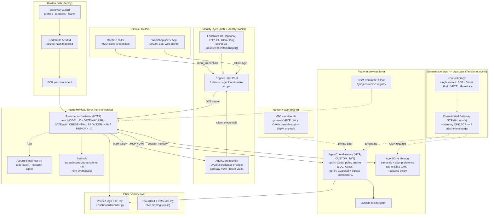

# Architecture

This is the AI landing zone as actually implemented by this repo: the CDK stacks
(`stacks/`), the control library (`control-library/`), the deploy golden path
(`scripts/deploy.sh` + CodeBuild), and the agent workloads (`agent-code/`).
Solid arrows are the live request flow verified end to end by `scripts/test.py`
and `scripts/invoke.py`; dotted arrows are opt-in features or control-plane
relationships.

## Reading the diagram, layer by layer

- **Governance (org scope, opt-in):** `terraform/org-guardrails/` attaches two SCPs
  per target — the consolidated Gateway SCP (8 controls) and the Memory CMK SCP.
  Both are generated from `control-library/`, the single source of truth for SCP,
  Cedar, IAM, VPCE, and Guardrail policy documents.
- **Identity:** the `auth` stack creates one Cognito User Pool with 3 app clients
  and the `agentcore/invoke` resource-server scope; a federated IdP (Entra ID,
  Okta, Ping) is optional and wired via `{{resolve:secretsmanager}}`. The
  `identity` stack registers the `gateway-m2m` OAuth2 credential provider in the
  AgentCore Identity Token Vault so the runtime can fetch M2M tokens itself.
- **Platform services:** the `gateway` stack exposes Lambda tool targets over MCP
  with CUSTOM_JWT auth (opt-in Cedar policy engine in LOG_ONLY mode, opt-in
  Guardrail + egress interceptor Lambda); the `memory` stack provisions semantic
  and user-preference strategies (opt-in KMS CMK + resource policy). Every stack
  publishes its outputs to the SSM `/{project}/{env}/*` registry.
- **Agent workload:** the orchestrator runtime (HTTP protocol) reads its wiring
  from environment variables set by the runtime stack, calls Bedrock
  (`us.anthropic.claude-sonnet-4-6` by default, env-overridable), and talks to the
  gateway with an M2M JWT it obtains through the credential provider. A2A
  sub-agent runtimes (code-agent, research-agent) are opt-in.
- **Golden path:** `scripts/deploy.sh` (profiles, modules, teams) drives CDK;
  each runtime stack owns an ECR repo and a source-hash-triggered ARM64 CodeBuild
  that produces the container the runtime runs.
- **Observability:** runtimes and the gateway emit vended logs and X-Ray traces;
  `dashboard/monitor.py` polls status for the local dashboard. CloudTrail with a
  KMS key and SNS alerting are opt-in via the `security` stack.
- **Network (opt-in):** the `networking` stack adds a VPC and endpoints; the
  gateway VPC endpoint policy allows OAuth pass-through while org-locking SigV4
  calls.
