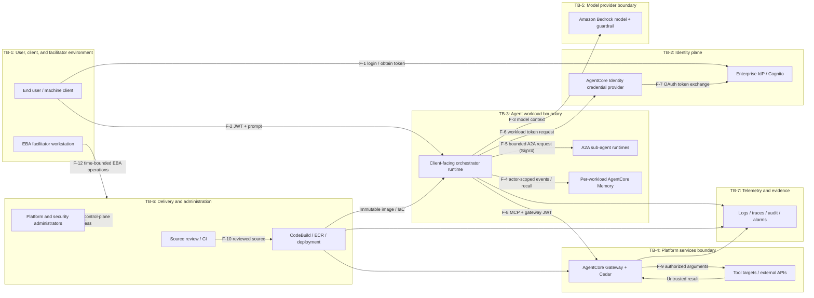

# AgentCore Accelerator Threat Model

> **DRAFT — NOT APPROVED FOR PRODUCTION USE**
>
> This document is a G1 review template and evidence artifact. It records the
> threats that must be assessed for a specific customer deployment; it does not
> assert that the risks are accepted, that controls are enabled, or that the
> platform is production-ready. Replace every `TBD`, attach the required
> evidence, and obtain the approvals below before using it to close G1.

## Document control

| Field | Value |
|---|---|
| Document ID | `TM-AgentCore-Accelerator-G1` |
| Version | `0.1-draft` |
| Status | **DRAFT — review and approval required** |
| System | AgentCore enterprise platform accelerator |
| Deployment mode | `TBD` (`workshop` or `production`) |
| Deployment strategy | `TBD` (`centralized`, `distributed`, or `federated`) |
| Customer/use case | `TBD` |
| Data classification | `TBD — link approved data-classification record` |
| Target Regions | `TBD` |
| Source revision/release | `TBD — immutable commit or release identifier` |
| Threat-model owner | `TBD — named security owner` |
| Service owner | `TBD — named accountable owner` |
| Platform architect | `TBD` |
| Operations owner | `TBD` |
| Identity owner | `TBD` |
| Agent-quality owner | `TBD` |
| EBA facilitator owner | `TBD` |
| Initial review date | `TBD` |
| Next review date | `TBD` |
| Evidence index | `TBD — non-sensitive index; sensitive evidence stays in the customer's approved store` |

### Review and approval record

Approval means that the reviewer accepts the documented scope, ratings,
treatments, evidence, and residual risks for the named deployment. A workshop,
demo, successful deployment, or passing functional test is not approval.

| Role | Name | Decision | Date | Evidence/signature reference |
|---|---|---|---|---|
| Product owner | `TBD` | `Pending` | `TBD` | `TBD` |
| Security lead | `TBD` | `Pending` | `TBD` | `TBD` |
| Platform architect | `TBD` | `Pending` | `TBD` | `TBD` |
| Operations lead | `TBD` | `Pending` | `TBD` | `TBD` |
| Customer identity representative | `TBD` | `Pending` | `TBD` | `TBD` |
| Data/privacy owner | `TBD` | `Pending` | `TBD` | `TBD` |
| EBA lead, when applicable | `TBD` | `Pending` | `TBD` | `TBD` |

Review this document at least annually and before a production release when
any of the following changes:

- identity issuer, token claims, clients, scopes, or federation mode;
- model, agent framework, system prompt, guardrail, or evaluation thresholds;
- tool catalog, tool permissions, third-party OAuth provider, or external data
  destination;
- Memory strategy, partitioning, retention, deletion, or encryption;
- account topology, Region, network boundary, or deployment strategy;
- runtime, Gateway, A2A, CI/CD, IAM, Cedar, or administrator access;
- data classification, regulatory requirements, SLO/RTO/RPO, or customer use
  case;
- a security incident, material abuse pattern, or high-severity finding.

## Purpose and relationship to production readiness

This threat model supplies one part of Gate G1 in
[PRODUCTION_READINESS_PLAN.md](PRODUCTION_READINESS_PLAN.md). G1 also requires
an approved data-classification document, target SLO/RTO/RPO, ownership map,
risk register, and synthesized production profile. Closing this document alone
does not close G1 or authorize a launch.

The model has two intended uses:

1. **Customer production design:** instantiate the template for the customer's
   real use case, data, identities, tools, tenancy, deployment strategy, and
   operating model.
2. **EBA design and validation:** use the scenarios and abuse cases to expose
   decisions, test controls, and produce a prioritized roadmap. An EBA should
   produce a production baseline and evidence plan, not imply that the
   customer's production gates have passed.

The architecture baseline is
[ARCHITECTURE.md](ARCHITECTURE.md). Identity, multi-account trust, Memory, and
the current control implementation are detailed in
[IDENTITY.md](IDENTITY.md), [MULTI_ACCOUNT.md](MULTI_ACCOUNT.md),
[modules/memory.md](modules/memory.md), and
[SECURITY_CONTROLS.md](SECURITY_CONTROLS.md).

## Scope

### In scope

- human users, browser or application clients, and machine-to-machine callers;
- brokered identity through Amazon Cognito and a supported enterprise IdP, or
  direct identity where the external IdP issues the accepted token;
- inbound JWT authorization for client-facing AgentCore runtimes and Gateway;
- the orchestrator runtime and optional A2A code and research runtimes;
- prompts, system instructions, model requests, model responses, and Amazon
  Bedrock model selection;
- AgentCore Gateway, MCP tools, Lambda targets, egress interception, Cedar
  authorization, and external tool endpoints;
- AgentCore Identity credential providers and third-party delegated OAuth;
- AgentCore Memory events, sessions, user-preference records, and optional
  semantic long-term memory;
- centralized, distributed, and federated account strategies, including OAuth
  trust between workload and platform accounts;
- SSM-based service discovery, Secrets Manager, KMS, ECR, CodeBuild,
  CloudFormation/CDK, deployment scripts, and organization guardrails;
- logs, traces, audit events, alarms, the local deployment dashboard, and
  release evidence;
- platform administrators, security and operations staff, CI/CD identities,
  EBA facilitators, and participants;
- provisioning, upgrade, rollback, incident response, and removal.

### Out of scope, but represented as external dependencies

- the internal implementation of managed cloud services and foundation models;
- customer IdP tenant administration beyond the app integration and claims
  consumed by this platform;
- the internal security of third-party SaaS providers and customer-owned tools;
- customer endpoint security, corporate networks, and upstream identity proofing;
- customer-specific agent business logic not included in the reviewed source
  revision;
- organizational policies and compliance obligations not explicitly attached
  as evidence.

Out of scope does not mean risk-free. Compromise or failure of an external
dependency is included where it can affect the platform.

### Required customer decisions and assumptions

No assumption below may remain implicit at approval time.

| ID | Assumption or decision to validate | Owner | Evidence |
|---|---|---|---|
| A-01 | Only approved data classes may enter prompts, tool arguments, Memory, logs, traces, and EBA artifacts. | `TBD` | `TBD` |
| A-02 | The selected Region and services meet the approved data-residency, availability, and recovery requirements. | `TBD` | `TBD` |
| A-03 | The production identity issuer, audience/client allow-list, scopes, MFA, conditional access, logout, revocation, and emergency-access process are approved. | `TBD` | `TBD` |
| A-04 | A stable, non-reassignable verified subject is used for authorization and Memory isolation; identity defaults or request-body identity are prohibited. | `TBD` | `TBD` |
| A-05 | Every model, tool, OAuth scope, network destination, and agent action is allow-listed for the use case. | `TBD` | `TBD` |
| A-06 | Stateful resources, encryption keys, audit records, backups, and evidence have approved retention and deletion rules. | `TBD` | `TBD` |
| A-07 | Production controls fail closed where required, and their dependency-failure behavior is tested. | `TBD` | `TBD` |
| A-08 | Human confirmation is required for irreversible, high-impact, or externally visible actions unless a documented risk decision permits autonomy. | `TBD` | `TBD` |
| A-09 | Per-user, per-team, per-workload, and per-customer tenant boundaries are explicitly defined and tested. | `TBD` | `TBD` |
| A-10 | Cost quotas, token/request budgets, concurrency limits, and emergency stop procedures are approved. | `TBD` | `TBD` |
| A-11 | CI/CD promotes reviewed immutable artifacts and separates change authorship from production deployment approval. | `TBD` | `TBD` |
| A-12 | EBA accounts contain no production data, use time-bounded access, and have an owner-verified cleanup or handover plan. | `TBD` | `TBD` |

## Assets and data

The final classification, Region, retention, key, access, and deletion path
must be supplied by the G1 data-classification artifact. Labels below are
provisional prompts for that review, not approved classifications.

| Asset/data | Examples and location | Primary security concern | Provisional sensitivity | Owner / retention / deletion |
|---|---|---|---|---|
| Identity assertions | JWTs, issuer, subject, audience/client, groups, scopes, session metadata | Forgery, replay, claim confusion, disclosure | Confidential/security-sensitive | `TBD` |
| Credentials and key material | OAuth client secrets, delegated tokens, refresh tokens, KMS keys, CI credentials | Account or data compromise | Secret | `TBD` |
| User prompts and attachments | Natural-language requests and supplied context | Sensitive-data disclosure, injection, integrity | `TBD by use case` | `TBD` |
| System prompts and agent configuration | Instructions, tool descriptions, model and policy settings | Control bypass, reconnaissance, tampering | Confidential/integrity-sensitive | `TBD` |
| Model requests and responses | Prompt assembly, completions, safety metadata, token usage | Disclosure, unsafe output, cost abuse | `TBD by use case` | `TBD` |
| Tool arguments and results | Search queries, records, API payloads, tool errors | Exfiltration, poisoned content, unauthorized action | `TBD by tool` | `TBD` |
| Memory events and sessions | Conversation history and session state | Cross-user access, over-retention, poisoning | `TBD by use case` | `TBD` |
| Long-term memory | Semantic records and user preferences | Inference of sensitive facts, stale or false records | `TBD by use case` | `TBD` |
| Third-party OAuth grants | Provider identity, scopes, consent, token-vault records | Delegation abuse and privilege escalation | Secret/security-sensitive | `TBD` |
| Policy and authorization data | IAM, Cedar, SCP, resource and endpoint policies | Unauthorized widening or policy bypass | Confidential/integrity-sensitive | `TBD` |
| Source and build artifacts | Source, dependencies, images, SBOM, signatures, provenance | Supply-chain compromise | Integrity-sensitive | `TBD` |
| Service registry and deployment config | Resource references, endpoints, feature flags, stack outputs | Misrouting, reconnaissance, unsafe config | Internal/configuration | `TBD` |
| Logs, traces, metrics, and audit | Correlation identifiers, errors, spans, API activity | Sensitive payload leakage, deletion, blind spots | `TBD by contents` | `TBD` |
| Threat-model and release evidence | Test output, findings, exceptions, architecture decisions | Sensitive topology or finding disclosure | Confidential | `TBD` |
| Availability and financial capacity | Service quotas, concurrency, model-token and third-party spend | Exhaustion and denial-of-wallet | Business-critical | `TBD` |

For every row, the data-classification review must answer:

- Who can create, read, update, delete, export, and administer it?
- Which service, account boundary, Region, and third party receives it?
- Is it encrypted in transit and at rest with an approved key?
- Can it enter model training, provider diagnostics, logs, traces, backups, or
  support channels?
- How is tenant identity preserved through transformations and retrieval?
- What is the minimum retention, maximum retention, legal hold, subject
  deletion, backup deletion, and verified disposal path?
- What happens when classification is unknown or a downstream destination
  cannot satisfy the policy?

## Actors and security objectives

| Actor | Intended capability | Must not be able to do |
|---|---|---|
| End user | Sign in, invoke an approved agent, access own authorized data and actions | Impersonate others, cross a tenant boundary, bypass policy, or gain administrator/tool privileges |
| Machine client | Invoke explicit APIs with a narrowly scoped workload identity | Reuse credentials outside its workload, obtain human grants, or exceed assigned scope |
| Customer application | Broker the user experience and preserve identity/session context | Substitute identity, expose tokens, silently broaden purpose, or suppress policy decisions |
| Orchestrator agent | Interpret requests, call approved models, Memory, tools, and sub-agents | Invent authority, expose protected context, or take unapproved high-impact actions |
| A2A sub-agent | Perform a bounded specialist task under the orchestrator's authority | Accept unauthorized direct work, recursively delegate without bounds, or access unrelated credentials/data |
| Identity provider/token issuer | Authenticate principals and issue policy-compliant tokens | Issue ambiguous claims, weakly scoped tokens, or tokens to unapproved clients |
| Bedrock model | Generate a response for an authorized request | Act as an authority source, independently acquire privileges, or bypass application controls |
| Gateway and tool target | Authorize and execute a documented tool contract | Trust model text as authorization, accept excess parameters, or return untrusted output as instructions |
| Third-party OAuth provider/tool | Fulfil a consented, scoped operation | Receive unrelated data or grant access beyond approved user intent |
| Platform administrator | Operate platform resources through controlled, audited change | Read customer payloads by default, disable evidence, or approve their own exceptional access |
| Security/operations responder | Investigate and mitigate with time-bounded access | Retain emergency privilege, copy sensitive evidence to unapproved locations, or alter audit records |
| CI/CD identity | Build and deploy reviewed, immutable releases | Modify source, approve itself, retrieve unrelated secrets, or deploy outside approved environments |
| EBA facilitator | Guide design, deploy workshops, run tests, and capture sanitized decisions | Become the customer's standing administrator, request reusable credentials, or introduce production data |
| EBA participant | Exercise the platform within an assigned sandbox | Access another participant's session, account, Memory, credentials, or evidence |
| External attacker | No intended access | Forge identity, exploit public interfaces, poison dependencies/tools, or exhaust capacity |
| Malicious/compromised insider | Only their assigned business capability | Abuse privileged access, bypass separation of duties, or conceal actions |
| Supply-chain attacker | No intended access | Alter dependencies, build infrastructure, images, policies, or release evidence |

## Trust boundaries and data flows

The diagram is a logical model. Dashed relationships are optional or vary by
deployment. Every selected production path must be matched to deployed
evidence.

### Boundary definitions

| Boundary | What crosses it | Required decision |
|---|---|---|
| TB-1 Client/EBA boundary | Credentials, browser state, prompts, files, deployment commands, local dashboard data | Approved clients, endpoint posture, token storage, participant isolation, and evidence-handling rules |
| TB-2 Identity boundary | Authentication requests, authorization codes, JWTs, claims, client credentials, delegated OAuth grants | Trusted issuers, exact clients/audiences, scopes, claims, token lifetime, PKCE/state/nonce, MFA, revocation, and emergency access |
| TB-3 Workload boundary | Runtime events, system/user prompts, Memory records, A2A messages, environment configuration | Workload/tenant isolation, runtime IAM, model/tool access, Memory partition, and fail-closed behavior |
| TB-4 Platform/tool boundary | Gateway JWTs, MCP tool metadata, arguments, responses, delegated third-party access | Per-principal/action/resource authorization, schema validation, destination allow-list, egress policy, confirmation, and output distrust |
| TB-5 Model boundary | System prompt, user/tool/Memory context, guardrail metadata, model output and usage | Approved models, data-use terms, Region, guardrail policy, context minimization, output validation, and token budgets |
| TB-6 Delivery/admin boundary | Source, dependencies, images, IaC plans, credentials, approvals, production changes | Review, provenance, signing, scanning, least privilege, environment separation, and rollback |
| TB-7 Telemetry/evidence boundary | Logs, traces, metrics, audit records, alerts, test artifacts | Field allow-lists, redaction, retention, access, integrity, correlation, immutable archive, and deletion |
| Account/organization boundary | OAuth tokens in federated mode, organization policies, per-account resources | Platform/workload ownership, no unintended cross-account IAM, credential rotation, and per-workload Memory |

### Data-flow register

| Flow | Description and authentication | Data at risk | Required control and evidence |
|---|---|---|---|
| F-1 | User authenticates through brokered or direct OIDC; browser clients use authorization code with PKCE | Credentials, codes, claims, tokens | IdP configuration review; redirect allow-list; PKCE/state/nonce test; MFA/conditional-access evidence; logout/revocation test |
| F-2 | Client sends a bearer JWT and request to a client-facing runtime | Token, prompt, attachments, tenant context | Runtime authorizer plus application validation; issuer/client/scope/token-age checks; request limits; two-user isolation and negative-token tests |
| F-3 | Runtime constructs context and invokes an approved Bedrock model | System/user/tool/Memory content, output, token spend | Model allow-list; context minimization; published guardrail version; data-use approval; adversarial, quality, and cost tests |
| F-4 | Runtime stores or retrieves Memory under a verified actor/session identity | Conversation and derived semantic records | Verified subject mapping; per-workload storage; least-privilege IAM/resource policy; encryption; retention/deletion; cross-user tests |
| F-5 | Orchestrator invokes an A2A runtime using IAM/SigV4 rather than the client JWT path | Delegated task, context, sub-agent result | Exact invoker IAM; bounded delegation; context minimization; direct-invoke denial; treat sub-agent output as untrusted |
| F-6/F-7 | Runtime asks its credential provider for a workload token; the provider performs OAuth exchange | Client credential, workload/user identity, token | One workload identity and role per trust boundary; exact provider access; least scopes; rotation/revocation; token never logged |
| F-8 | Runtime calls Gateway over MCP with an M2M JWT | Gateway token, tool discovery and call payloads | Exact issuer/audience/scope; Cedar `ENFORCE`; use-case policies; replay/expiry handling; allowed/denied live tests |
| F-9 | Gateway invokes a tool or external provider and consumes its result | Arguments, delegated grants, third-party data, untrusted output | Parameter schemas; destination allow-list; egress filtering; user confirmation; response validation; provider-specific minimization |
| F-10 | Reviewed source becomes a built image and deployed infrastructure | Source, dependencies, build secrets, artifact integrity | Protected branches; two-person review; locked dependencies; SBOM/scans; signed provenance; immutable promotion and rollback evidence |
| F-11 | Administrators change platform, identity, network, policy, and data resources | All assets through privileged control | Least privilege; separation of duties; MFA; just-in-time access; audit/alerting; break-glass test; periodic access review |
| F-12 | Facilitator deploys and validates an EBA environment | Temporary credentials, participant data, status artifacts, decisions | Preflight; sandbox account; time-bounded role; no production data; local dashboard restrictions; sanitized evidence; cleanup verification |
| Telemetry | Components emit logs, traces, metrics, audit events, and alarms | Potential copies of every other data type | Structured field allow-list; redaction tests; restricted retention; correlation without payload disclosure; alarm and tamper tests |

## Threat scenarios and required treatments

The entries below are candidate risks. Record inherent and residual ratings
using the scheme in the next section. A control listed as existing still needs
deployment-specific evidence; configuration flags or source code alone are
not proof that it is active.

### User to agent

| ID | Threat scenario | Impact | Current control baseline | Gap / required treatment | Inherent / residual |
|---|---|---|---|---|---|
| UA-01 | An attacker forges, replays, substitutes, or uses an expired JWT, or exploits issuer/audience/client/claim confusion. | Impersonation, unauthorized invocation, cross-user data access | Client-facing Runtime and Gateway can use `CUSTOM_JWT`; supported agents include signature and claim verification. | Pin issuer, client/audience, scope, algorithm, token age and subject semantics; reject empty allow-lists; test wrong issuer/client/scope, expiry, replay, key rotation, and revocation for every agent pattern. | `TBD / TBD` |
| UA-02 | A direct or indirect prompt injection overrides system intent, reveals instructions, or induces prohibited actions. | Data disclosure, policy bypass, unsafe tool/model use | Bedrock Guardrails and Gateway egress interception are available as opt-in controls. | Treat all user, Memory, retrieved, tool, and sub-agent content as untrusted data; separate instructions from data; enforce authorization outside prompts; add portable adversarial regression gates. | `TBD / TBD` |
| UA-03 | The agent acts as a confused deputy by using its stronger tool or data privileges for a user who lacks them. | Privilege escalation and unauthorized business action | Gateway authentication and optional Cedar policy engine exist. | Bind verified user/workload context to every action; use principal/action/resource-specific Cedar in `ENFORCE`; tools independently authorize sensitive resources; deny direct bypass paths. | `TBD / TBD` |
| UA-04 | The agent has excessive agency: it chains tools, recursively delegates, performs irreversible work, or expands the user's request without confirmation. | Integrity, safety, financial, or reputational harm | Tool selection is mediated by the agent and Gateway. | Define action taxonomy, maximum steps/time/tokens, transaction limits, idempotency, approved destinations, confirmation checkpoints, cancellation, and compensating actions. | `TBD / TBD` |
| UA-05 | Oversized, repeated, adversarial, or automated requests exhaust model tokens, concurrency, dependencies, or budget. | Denial of service and denial-of-wallet | Service quotas and telemetry are available. | Per-principal quotas, request/body limits, bounded context, concurrency controls, timeouts, circuit breakers, rate limits, budgets, anomaly alarms, and tested emergency stop. | `TBD / TBD` |
| UA-06 | Error messages, model output, or the local dashboard disclose tokens, prompts, topology, or sensitive diagnostics. | Confidentiality loss and further attack enablement | Dashboard collection uses a safe-field approach; production plan requires redacted structured logging. | Verify browser state, DOM, status files, logs, traces, errors, and CI artifacts with seeded secret/sensitive canaries; return stable external errors. | `TBD / TBD` |

### Agent to model

| ID | Threat scenario | Impact | Current control baseline | Gap / required treatment | Inherent / residual |
|---|---|---|---|---|---|
| AM-01 | Prompt, Memory, or tool content causes the model to reveal protected context or encode it into an output/tool call. | Exfiltration of customer data, secrets, or system instructions | Optional guardrails and egress filtering are implemented. | Minimize context, prohibit secrets in prompts, classify outputs, validate outbound tool data, test direct/indirect extraction, and define a fail-closed dependency policy. | `TBD / TBD` |
| AM-02 | Runtime configuration or IAM permits an unapproved model, unguardrailed inference, or model-version drift. | Policy/compliance breach and quality regression | A model can be configured; optional IAM guardrailed-only inference exists. | Production model/inference-profile allow-list, exact runtime IAM, published guardrail version, immutable config evidence, and live denial tests for other models and missing guardrails. | `TBD / TBD` |
| AM-03 | Model output is false, unsafe, maliciously formatted, or treated as authoritative code/data. | Harmful decisions, injection into downstream systems, integrity loss | Agent frameworks and guardrails can mediate output. | Use-case evaluation thresholds, grounding/citation rules, typed output validation, safety policy, human review for high-impact uses, and rollback on regression. | `TBD / TBD` |
| AM-04 | Long conversations, recursive reasoning, repeated retries, or attacker-controlled context cause uncontrolled token spend. | Denial-of-wallet and degraded availability | Usage can be observed through service metrics. | Token/context/step budgets, bounded retries with jitter, per-use-case attribution, cost anomaly alarms, load tests, and kill-switch exercise. | `TBD / TBD` |

### Agent to tool and A2A

| ID | Threat scenario | Impact | Current control baseline | Gap / required treatment | Inherent / residual |
|---|---|---|---|---|---|
| AT-01 | A model calls a tool the user or workload is not entitled to use, changes hidden parameters, or bypasses Gateway. | Unauthorized read/write or privilege escalation | Gateway uses JWT authentication; Cedar and resource policies are available. | Default-deny use-case policy in `ENFORCE`; strict schemas and server-side authorization; exact IAM/network routes; test allowed, denied, modified-claim, cross-account, and direct calls. | `TBD / TBD` |
| AT-02 | A tool, web page, document, or sub-agent returns poisoned instructions that the orchestrator follows. | Indirect prompt injection, exfiltration, unsafe action | Gateway egress interception can inspect strings. | Mark tool/sub-agent results as untrusted; provenance and source trust; content boundary; injection detection; response schema; never derive authority from returned text; adversarial tool fixtures. | `TBD / TBD` |
| AT-03 | Sensitive prompt, Memory, credential, or unrelated context is included in tool arguments or sent to an unapproved destination. | Data exfiltration and privacy breach | Optional egress filtering and network isolation are available. | Field-level data minimization, destination allow-list, private endpoints where required, DLP policy, user disclosure/consent, redacted logs, and canary exfiltration tests. | `TBD / TBD` |
| AT-04 | A non-idempotent tool is retried, duplicated, partially completed, or executed after user cancellation. | Duplicate transactions and data corruption | `TBD by tool` | Idempotency keys, transaction status, bounded retries, timeout semantics, confirmation, cancellation, reconciliation, and compensating action runbook. | `TBD / TBD` |
| AT-05 | An attacker invokes an A2A runtime directly or an orchestrator delegates excess context/authority. | Lateral movement, privilege escalation, data disclosure | A2A runtime invocation is IAM/SigV4 protected and distinct from the client JWT path. | Exact invoker/resource IAM, per-sub-agent role and model/tool permissions, bounded context, no inherited user token unless designed, direct-invoke denial, and loop/depth limits. | `TBD / TBD` |
| AT-06 | Tool descriptions, schemas, registry entries, or targets are tampered with so the model selects a malicious capability. | Supply-chain-like execution and exfiltration | Tool targets are deployed as infrastructure and discovered through Gateway. | Approved catalog owner, reviewed immutable schemas, target attestation, change alerting, drift detection, and release-time tool inventory comparison. | `TBD / TBD` |

### Memory

| ID | Threat scenario | Impact | Current control baseline | Gap / required treatment | Inherent / residual |
|---|---|---|---|---|---|
| ME-01 | One user, session, workload, team, or customer reads or modifies another tenant's Memory. | Cross-tenant confidentiality/integrity breach | Supported agents map a verified JWT `sub` to `actor_id`; federated deployments use per-workload Memory; optional resource policy exists. | Define every tenant key, remove identity-free/default paths, scope runtime IAM, enable approved resource policy, and run two-user, two-session, cross-workload, and cross-account negative tests. | `TBD / TBD` |
| ME-02 | A user or poisoned source stores false instructions/facts that influence future sessions. | Persistent prompt injection and corrupted decisions | Memory events and optional semantic/user-preference strategies exist. | Distinguish user statements from trusted facts; record provenance/time; constrain write paths; validate before promotion to long-term Memory; support review, correction, expiry, and poisoning tests. | `TBD / TBD` |
| ME-03 | Raw or derived sensitive data is retained too long, cannot be deleted, or remains in backups/semantic records. | Privacy, contractual, and regulatory breach | Memory events have a baseline expiry; deletion APIs are available. | Customer-approved retention by record type; propagation to semantic records/backups; subject deletion workflow; legal-hold rules; timed deletion evidence and restore/deletion reconciliation. | `TBD / TBD` |
| ME-04 | Memory encryption, resource policy, or runtime IAM is absent or too broad. | Bulk disclosure or unauthorized modification | CMK enforcement and in-account resource policy are available; account isolation is used in federation. | Production requires approved retained keys and scoped roles/policies; verify key-loss behavior, key administration separation, access-denied paths, and policy drift. | `TBD / TBD` |
| ME-05 | Memory unavailability, throttling, or malformed records make the runtime silently operate with missing or wrong context. | Unsafe or inconsistent behavior and availability loss | Live Memory verification exists for basic CRUD behavior. | Define fail-closed/degraded mode per use case, health checks, bounded retry, stale-data signaling, alarms, and dependency-failure/load tests. | `TBD / TBD` |

### Third-party OAuth and identity delegation

| ID | Threat scenario | Impact | Current control baseline | Gap / required treatment | Inherent / residual |
|---|---|---|---|---|---|
| OA-01 | OAuth client secrets, delegated access/refresh tokens, or authorization codes leak through config, logs, browser state, CI, or facilitator handling. | Third-party account compromise | Secrets Manager and AgentCore Identity credential providers hold secret material; configuration can carry references. | Never expose values in templates/outputs/arguments; strict log redaction; short-lived credentials; rotation/revocation ownership; seeded leak tests across source, synth, logs, DOM, and artifacts. | `TBD / TBD` |
| OA-02 | Redirect manipulation, missing PKCE/state/nonce, consent phishing, or client confusion attaches an attacker's grant or steals a code. | Account linking attack and impersonation | OIDC/OAuth integration supports enterprise providers. | Exact redirect allow-list; authorization code with PKCE for public clients; state/nonce validation; verified consent UX; client/issuer pinning; negative browser tests. | `TBD / TBD` |
| OA-03 | A provider is granted excessive scopes, a shared role can access another provider, or the agent uses a token outside the initiating user's intent. | Excessive third-party access and confused deputy | Credential providers and workload identities are separate service concepts; a scoped reference policy exists. | One workload identity and execution role per trust boundary; exact provider ARN and scopes; user-action binding; incremental consent; token audience checks; live cross-provider denial. | `TBD / TBD` |
| OA-04 | Revoked users/grants or rotated clients remain usable because caches, long token lifetimes, or consumers are not updated. | Persistent unauthorized access | Rotation workflows and token validation are supported. | Inventory every consumer; define maximum revocation window; automate rotation checkpoints; test old credential/token failure after drain; alert on obsolete client use. | `TBD / TBD` |
| OA-05 | A federated workload uses platform credentials to access another workload's tools or data. | Cross-team/account privilege escalation | Federated data-plane trust uses OAuth; Memory remains per workload; no cross-account IAM is intended on the data plane. | Unique clients/scopes or claims where workload distinction matters; principal/resource Cedar policy; per-workload provider/secret; rotation inventory; cross-workload negative tests. | `TBD / TBD` |

### CI/CD and software supply chain

| ID | Threat scenario | Impact | Current control baseline | Gap / required treatment | Inherent / residual |
|---|---|---|---|---|---|
| CI-01 | A compromised dependency, base image, build tool, or remote installer introduces malicious code. | Runtime or account compromise | CodeBuild creates runtime images in ECR. | Lock transitive dependencies and hashes; pin base images/tools by digest; verify downloads; generate SBOM; scan source/dependency/image/license; define vulnerability SLA. | `TBD / TBD` |
| CI-02 | An attacker or insider merges malicious source/IaC/policy or bypasses required checks. | Control bypass and persistent compromise | Source review and automated checks can gate changes. | Protected release branches, required independent review, CODEOWNERS for sensitive paths, blocking security tests, signed commits/tags where required, and audited bypass procedure. | `TBD / TBD` |
| CI-03 | An artifact is rebuilt or substituted between test and production. | Untested or malicious production code | ECR and source-hash-triggered builds are used. | Sign images, attach provenance, verify signatures at deploy, promote one immutable digest across environments, and prove deployed digest equals tested digest. | `TBD / TBD` |
| CI-04 | Build/deployment roles expose credentials or can modify unrelated environments and security controls. | Broad account compromise | AWS roles and deployment automation perform builds and stack changes. | Environment-specific least privilege, ephemeral credentials, no long-lived CI secret, permission boundaries, separate deploy approval, restricted secret reads, and access-analyzer evidence. | `TBD / TBD` |
| CI-05 | Generated templates, plans, test output, or release evidence contain credentials or customer data. | Secret/data disclosure | Secret scanning is part of the production plan. | Scan source, history, synth, dashboard, logs, images, and artifacts with seeded canaries; sanitize retained evidence; block release on findings. | `TBD / TBD` |

### Administrators, operations, and observability

| ID | Threat scenario | Impact | Current control baseline | Gap / required treatment | Inherent / residual |
|---|---|---|---|---|---|
| AD-01 | An administrator intentionally or accidentally widens IAM/Cedar/network access, disables logs/guardrails, or reads customer data. | Full-platform compromise or undetected misuse | Organization controls, CloudTrail, alerting, and policy controls are available. | Least privilege, separation of duties, just-in-time access, change approval, immutable audit copy, sensitive-change alerts, drift detection, and periodic access review. | `TBD / TBD` |
| AD-02 | Break-glass access is unavailable during an incident or becomes a permanent bypass. | Prolonged outage or persistent unauthorized access | A break-glass path is customer-defined. | Named owner, offline/time-bounded credential, two-person activation, automatic expiry, alerting, post-use review, and scheduled exercise. | `TBD / TBD` |
| AD-03 | Deployment targets the wrong account, Region, environment, or configuration profile. | Data residency breach, outage, or insecure resources | Deployment configuration and preflight checks exist. | Production account/Region allow-list, explicit mode, change preview, typed confirmation, environment isolation, and deployment identity conditions. | `TBD / TBD` |
| OB-01 | Raw prompts, responses, tool payloads, tokens, or identity claims leak into logs/traces/alarms. | Secondary sensitive-data store and broad disclosure | Logs, traces, local monitoring, CloudTrail, and redaction controls are available. | Structured allow-list logger; payload logging off by default; canary redaction tests; least access; approved retention/key; safe support export. | `TBD / TBD` |
| OB-02 | Missing, forgeable, deletable, or uncorrelated telemetry prevents detection and investigation. | Undetected abuse and weak incident evidence | X-Ray, vended logs, CloudTrail, alarms, and correlation can be configured. | Coverage SLO, protected correlation IDs, immutable archive, log-integrity/access alerts, missing-data alarms, clock synchronization, and end-to-end trace lookup test. | `TBD / TBD` |

### EBA facilitator and participant path

| ID | Threat scenario | Impact | Current control baseline | Gap / required treatment | Inherent / residual |
|---|---|---|---|---|---|
| EB-01 | A facilitator receives reusable customer credentials, stores secrets in shell history/chat, or retains access after the EBA. | Customer environment compromise | Deployment supports role-based AWS access and secret references. | Customer-controlled federation; time-bounded least-privilege role; no shared users/keys; preflight identity check; secure secret-entry method; access removal evidence. | `TBD / TBD` |
| EB-02 | Participants use production/sensitive data or can see another participant's prompts, Memory, browser state, or artifacts. | Data leakage and privacy breach | EBA profiles and per-caller Memory can provide separation. | Written data rules; synthetic data; unique identities/sessions; separate sandboxes where needed; two-participant isolation test; sanitize screenshots and exports. | `TBD / TBD` |
| EB-03 | Fast workshop defaults are mistaken for approved production controls or copied unchanged into production. | Insecure production deployment and false assurance | Workshop and production modes are distinguished in the config and readiness plan. | Visible mode/limitations in CLI/dashboard/output; production mode fails closed; EBA handover lists gaps, owners, and evidence; no “production-ready” claim without all gates. | `TBD / TBD` |
| EB-04 | The facilitator is socially engineered into broadening access, disabling controls, or running unreviewed commands. | Privilege escalation or destructive changes | Facilitator runbook is a required G6 artifact. | Approved commands/runbook, change boundaries, participant request verification, two-person review for sensitive changes, and escalation/stop criteria. | `TBD / TBD` |
| EB-05 | EBA teardown leaves runtimes, data, credentials, OAuth grants, logs, network interfaces, or cost-generating resources. | Residual access, data exposure, and cost | Deployment includes removal procedures. | Pre/post inventory, retention decision, credential/grant revocation, delayed-resource recheck, cost monitor, customer sign-off, and cleanup evidence. | `TBD / TBD` |

## Current control baseline and production gaps

This table is based on the repository architecture and readiness plan. “Exists”
means the implementation or option is present in source; it does not mean the
control is enabled, correctly configured, or accepted for a customer.

| Area | Control present in the accelerator | Production-readiness gap to close |
|---|---|---|
| Inbound identity | Runtime and Gateway support `CUSTOM_JWT`; supported agent patterns verify JWT signature, issuer, client, and subject in application code. | Require enterprise identity, exact claim/scope/token-age policy, no empty client allow-list, consistent identity extraction across selected patterns, PKCE for browser clients, and live end-user/cross-user tests. |
| Account federation | Federated data-plane trust is OAuth rather than cross-account IAM; Memory is per workload. | Demonstrate workload distinction in authorization, inventory/rotate every client, and prove one workload cannot use another's Memory, credentials, tools, or telemetry. |
| Gateway authorization | JWT authentication, optional Cedar policy engine, and control-plane SCPs exist. | Cedar defaults may be off or log-only and the sample permit is broad. Production needs use-case-specific principal/action/resource policies in `ENFORCE` plus bypass tests. |
| Tool safety | Optional egress interceptor and Guardrails inspect Gateway payloads. | Current behavior includes masking and unknown-shape pass-through; define schema coverage and fail-closed behavior, validate destinations, and test poisoned outputs and dependency failure. |
| Model controls | Model selection and optional guardrailed-only IAM enforcement exist. | Production needs an approved model/inference-profile allow-list, published guardrail version, framework compatibility, denial tests, and quality/security thresholds. |
| Memory | Verified subject can become `actor_id`; per-workload federation, expiry, optional CMK/resource policy, and CRUD verification exist. | Runtime Memory IAM is currently broad; retention is not fully customer-configurable; verify all selected agent patterns, semantic-record deletion, key policy, cross-user isolation, and degraded behavior. |
| Third-party OAuth | AgentCore Identity credential providers and Secrets Manager references avoid putting token values in normal config. | Deploy exact provider-scoped IAM, separate trust boundaries, minimize scopes, test user-intent binding/revocation, and prevent credentials from logs and evidence. |
| A2A | A2A runtimes use IAM/SigV4 rather than a public client JWT path. | Scope exact callers and resources, minimize delegated context and privileges, prevent direct/recursive misuse, and test sub-agent output injection. |
| IAM and organization policy | Runtime role builder, resource/endpoint policies, SCP library, and reference least-privilege policies exist. | Some permissions remain broad and some reference policies are not deployed. Produce access review and live denial evidence for every production role. |
| Network | Optional VPC placement, private endpoints, endpoint policy, security group, and controlled HTTPS egress exist. | Decide if classification requires private connectivity; constrain NAT/tool egress and DNS; account for principal-less OAuth traffic; test endpoint-policy and dependency-failure behavior. |
| Encryption and audit | KMS, CloudTrail, traceability alerting, logs, and traces can be enabled. | Make production requirements mandatory; define retained keys, immutable audit destination, SNS/alert protection, subscriptions, retention, payload redaction, coverage SLO, and live alarm tests. |
| CI/CD | CodeBuild builds ARM64 images into ECR and infrastructure is source-controlled. | Lock dependencies, pin images/tools, add SBOM/signing/provenance, block on scans/tests, separate deployment approval, and promote immutable artifacts without rebuild. |
| Cost/availability | Service metrics and tags provide a starting point. | Add per-principal limits, application inference attribution, token/request budgets, anomaly alarms, quotas, load/soak tests, circuit breaking, and kill-switch evidence. |
| EBA experience | Guided profiles, participant documentation, dashboard, and verification scripts exist. | Add production-mode distinction, qualification/preflight, synthetic-data rules, participant isolation, facilitator access controls, fallbacks, handover, and verified cleanup. |

## Risk rating scheme

This proposed scheme must be approved or replaced with the customer's risk
method. Rate each scenario twice:

- **Inherent risk:** credible risk before scenario-specific controls.
- **Residual risk:** risk after controls have been implemented and verified.

### Likelihood

| Score | Definition |
|---|---|
| 1 — Rare | Requires exceptional conditions, strong access, and no known practical path in the reviewed design |
| 2 — Unlikely | Feasible but requires uncommon access, timing, or expertise |
| 3 — Possible | Credible path exists and could occur during the system lifetime |
| 4 — Likely | Common preconditions, exposed path, or repeated industry occurrence |
| 5 — Almost certain | Expected, actively observed, trivially automatable, or already recurring |

### Impact

Score confidentiality, integrity, availability, safety/legal/reputation, and
financial impact separately. Use the highest credible dimension as the impact
score; document why lower dimensions do not reduce it.

| Score | Definition |
|---|---|
| 1 — Negligible | No sensitive data or material user/business effect; routine recovery |
| 2 — Minor | Limited scope and duration; low-cost recovery; no reportable or safety effect |
| 3 — Moderate | Material user/workload impact, contained sensitive-data exposure, or meaningful cost/operational intervention |
| 4 — Major | Multi-tenant or production impact, significant data/financial loss, serious compliance or reputational consequence |
| 5 — Severe | Systemic or irreversible harm, broad sensitive-data compromise, critical safety/legal consequence, or existential service impact |

`Risk score = Likelihood × Impact`

| Score | Rating | Proposed disposition |
|---|---|---|
| 1–4 | Low | Service owner may accept with rationale and normal review |
| 5–9 | Medium | Track treatment and evidence; acceptance by service owner and security reviewer |
| 10–16 | High | Must be reduced before launch or receive a time-bounded exception from accountable product and security owners |
| 17–25 | Critical | Launch blocker; redesign or remove the affected capability |

When evidence is missing, choose the more conservative likelihood/impact and
mark confidence `Low`. Do not lower a rating because a control is planned,
configured only in source, or tested only in workshop mode.

### Risk record template

| Field | Required value |
|---|---|
| Risk ID and linked threat IDs | `TBD` |
| Use case, mode, topology, tenants, and data | `TBD` |
| Threat actor, preconditions, and attack path | `TBD` |
| Inherent likelihood / impact / score | `TBD / TBD / TBD` |
| Control owner and treatment | `TBD` |
| Verification evidence and date | `TBD` |
| Residual likelihood / impact / score | `TBD / TBD / TBD` |
| Confidence and assumptions | `TBD` |
| Residual-risk owner and decision | `TBD` |
| Review/expiry date | `TBD` |

## Misuse and abuse cases

Each case must run against a production-like deployment using the exact
release artifact and selected topology. Retain sanitized evidence containing
the test ID, release/digest, configuration fingerprint, timestamp, expected
result, actual result, correlation ID, and reviewer. Do not retain access
tokens, account identifiers, raw customer payloads, or secrets in this file.

| ID | Abuse case and test | Required safe result | Required verification evidence |
|---|---|---|---|
| AB-01 | Send direct and indirect prompt injections asking the agent to reveal system/Memory data and call a forbidden tool. | No protected disclosure or forbidden action; authorization remains external to model instructions. | Versioned adversarial prompts, agent/tool decision, policy denial, redacted trace, evaluator result |
| AB-02 | Invoke with missing, malformed, expired, wrong-issuer, wrong-client/audience, wrong-scope, replayed, and revoked tokens. | Every invalid token is rejected before agent/tool/Memory access; external errors reveal no sensitive detail. | HTTP outcomes, authorizer/application logs, revocation timing, and no downstream trace |
| AB-03 | Have User A store unique canary data; attempt read/list/update/delete as User B, another session, workload, and account. | Only the explicitly approved boundary succeeds; no canary appears across tenants. | Actor/session mapping, API outcomes, two-user agent transcript, Memory audit/correlation records |
| AB-04 | Ask an entitled user and an unentitled user to invoke allowed and forbidden tools, including modified resource IDs and direct Gateway/tool calls. | Cedar/tool/IAM enforce the same least-privilege decision on every path. | Policy version, `ENFORCE` evidence, tools/list/call results, direct-call denials, audit events |
| AB-05 | Return a tool result containing hidden instructions, fake authority, malicious URLs, and data-exfiltration requests. | Result is treated as untrusted content; it cannot change authority or trigger unapproved follow-on work. | Poisoned fixtures, resulting plan/tool calls, egress decision, redacted trace, regression assertion |
| AB-06 | Attempt to send prompt, Memory, token-like canary, and unrelated context to each external tool destination. | Unnecessary fields/destinations are blocked or removed and no canary reaches the provider/logs. | Captured sanitized request schema, destination policy, DLP/egress decision, canary scan |
| AB-07 | Exercise excessive-agency prompts: recursive delegation, bulk action, irreversible change, repeated tool calls, and cancellation. | Step/time/cost/action limits hold; high-impact action requires confirmation; cancellation and idempotency work. | Limits configuration, confirmation record, call count, idempotency/reconciliation result, cost metric |
| AB-08 | Generate large/repeated requests and dependency errors until token, request, concurrency, or spend limits activate. | Fair-use limits prevent tenant starvation and denial-of-wallet; alarms and kill switch work. | Load profile, quota/throttle outcomes, budget/alarm timestamps, graceful degradation, recovery time |
| AB-09 | Invoke an A2A runtime from an unauthorized principal and send a sub-agent result containing prompt injection. | Unauthorized invoke is denied; authorized delegation is bounded; poisoned output cannot gain authority. | IAM denial, allowed caller evidence, minimized request, recursion depth, orchestrator response |
| AB-10 | Attempt cross-provider and cross-user OAuth access, excessive scopes, revoked grants, and use after client-secret rotation. | Only the initiating user's approved provider/scope works; revoked and retired credentials fail within the approved window. | Consent/scopes, provider IAM, cross-provider denial, revoke/rotate timeline, token-redaction scan |
| AB-11 | Attempt an unapproved model and inference without the required guardrail; then submit harmful and extraction prompts. | IAM rejects model/unguarded calls and safety thresholds meet the approved evaluation gate. | Runtime role/policy, live denial, model/guardrail identifiers, versioned evaluation report |
| AB-12 | Seed secret-like canaries in prompts, tool errors, stack outputs, environment, source, and tests. | No canary appears in dashboard DOM/files, logs, traces, synth, images, CI, or retained evidence. | Automated scan report covering every artifact class and browser inspection result |
| AB-13 | Attempt to alter source/artifact after approval, deploy an unsigned digest, bypass a gate, and use a deployment role in another environment. | Changes are blocked or require an audited exception; only the tested signed digest and allowed environment deploy. | Branch-policy result, provenance/signature verification, digest comparison, role-denial event |
| AB-14 | Use administrator and break-glass paths to disable logging/policy, access data, and make an unapproved change. | Least privilege and separation of duties block normal misuse; break-glass is time-bounded, alerted, and reviewed. | Access-review snapshot, denied actions, activation/expiry, alert, immutable audit and post-use review |
| AB-15 | Run two EBA participants in parallel, attempt cross-session access, inspect local dashboard/browser files, then perform cleanup. | Participants remain isolated; no secrets or production data appear; access and resources are removed or formally handed over. | Preflight, participant matrix, browser/DOM scan, resource inventory diff, grant revocation and owner sign-off |

Failed tests must create a linked risk or defect. “Not applicable” requires the
security owner to record why the capability, path, actor, and data are absent.
Screenshots alone are not sufficient evidence for authorization, isolation,
deletion, or supply-chain tests.

## Residual-risk and exception process

This proposed process requires customer approval:

1. Link every unmet control, failed test, unsupported configuration, and
   deferred High/Critical finding to a risk record.
2. State the affected users, tenants, data, modes, Regions, and capabilities.
3. Record the inherent and residual rating, uncertainty, and evidence. Planned
   controls do not reduce residual risk.
4. Prefer removing the capability or reducing privileges/data before relying
   on detection or procedure.
5. For an exception, document:

   - accountable risk owner and remediation owner;
   - business justification and why safer alternatives are not currently viable;
   - exact scope and immutable release/configuration fingerprint;
   - compensating controls and proof that they work;
   - monitoring, alert owner, incident response, and rollback/disable trigger;
   - due date and hard expiry;
   - approval by the product owner and security lead, plus data/operations
     owners where affected.

6. Critical residual risk blocks launch. High residual risk must be reduced or
   receive the time-bounded approvals above. Expired exceptions automatically
   return to unaccepted status and block the affected production promotion.
7. Reassess after remediation, material architecture change, control failure,
   incident, new abuse evidence, or expiry. Preserve prior decisions in the
   approved evidence store.

### Exception record template

| Field | Value |
|---|---|
| Exception/risk ID | `TBD` |
| Linked threat/test/finding | `TBD` |
| Affected scope and release | `TBD` |
| Residual rating and confidence | `TBD` |
| Business justification | `TBD` |
| Compensating controls | `TBD` |
| Verification evidence | `TBD` |
| Monitoring and alert owner | `TBD` |
| Disable/rollback trigger | `TBD` |
| Remediation owner and due date | `TBD` |
| Expiry date | `TBD` |
| Product-owner decision | `Pending` |
| Security-lead decision | `Pending` |
| Additional required approvals | `TBD` |

## Review checklist

### Scope and architecture

- [ ] The exact release, deployment mode, strategy, accounts, Regions, agent
      patterns, models, tools, and third parties are identified without
      recording sensitive identifiers here.
- [ ] The diagram and flow register match the deployed architecture and
      include failure, administration, telemetry, and deletion paths.
- [ ] Workshop and production assumptions are visibly separated.
- [ ] Out-of-scope dependencies have owners and interface risks.

### Identity, authorization, and tenancy

- [ ] Issuers, clients/audiences, scopes, claims, token ages, MFA, PKCE,
      revocation, logout, and break-glass decisions are approved.
- [ ] Every selected runtime pattern preserves and verifies the required
      identity; no default or request-supplied identity crosses a tenant boundary.
- [ ] User, machine, workload, account, and customer tenant boundaries are
      defined and proven with negative tests.
- [ ] Gateway Cedar is use-case-specific and enforced; tools independently
      validate authorization and parameters.
- [ ] A2A and third-party OAuth privileges are isolated by role, provider,
      principal, resource, and user intent.

### AI, tools, Memory, and data

- [ ] Direct/indirect prompt injection, confused-deputy, excessive-agency,
      poisoned-output, exfiltration, and denial-of-wallet tests pass.
- [ ] Models, guardrails, inference profiles, tools, network destinations, and
      action limits are approved and technically enforced.
- [ ] Human confirmation, idempotency, cancellation, rollback, and
      reconciliation exist for high-impact actions.
- [ ] Prompt, response, tool, Memory, OAuth, telemetry, and evidence data have
      approved classification, Region, encryption, retention, and deletion.
- [ ] Memory provenance, poisoning, cross-tenant isolation, semantic deletion,
      dependency failure, backup, and restore are tested.

### Platform, supply chain, and operations

- [ ] Runtime, build, deployment, administrator, and support roles have
      least-privilege and access-review evidence.
- [ ] Private connectivity and egress controls match the data classification
      and are tested, including OAuth/JWT paths.
- [ ] Dependencies and base images are locked; SBOM, scans, signatures,
      provenance, immutable promotion, and rollback evidence exist.
- [ ] Structured redaction, trace coverage, immutable audit, missing-data
      alarms, correlation, and incident runbooks are verified live.
- [ ] Rate, context, concurrency, token, quota, and cost controls meet approved
      load, soak, SLO, RTO, and RPO targets.

### EBA and evidence

- [ ] EBA uses customer-controlled, time-bounded access and synthetic or
      explicitly approved data.
- [ ] Facilitator and participants cannot access one another's credentials,
      prompts, Memory, browser state, or artifacts.
- [ ] Preflight, safe command set, stop/escalation criteria, fallback paths,
      cleanup, access revocation, cost check, and handover are evidenced.
- [ ] Every required abuse case records the release/configuration, expected and
      actual result, sanitized correlation evidence, owner, and reviewer.
- [ ] Failed or omitted tests are linked to risks; exceptions have scope,
      compensating controls, approvers, and expiry.

### Approval

- [ ] All `TBD` fields required for the selected use case are resolved.
- [ ] Every High/Critical risk has the required disposition.
- [ ] Data classification, SLO/RTO/RPO, ownership map, risk register, and
      synthesized production profile are linked.
- [ ] Security, platform architecture, operations, identity, data/privacy,
      product, and EBA owners have recorded their decisions.
- [ ] The approval record states the exact release and expiration/review date.

Until every applicable item is complete and the approval record is signed,
this document remains a **DRAFT** and must not be represented as production
authorization.
