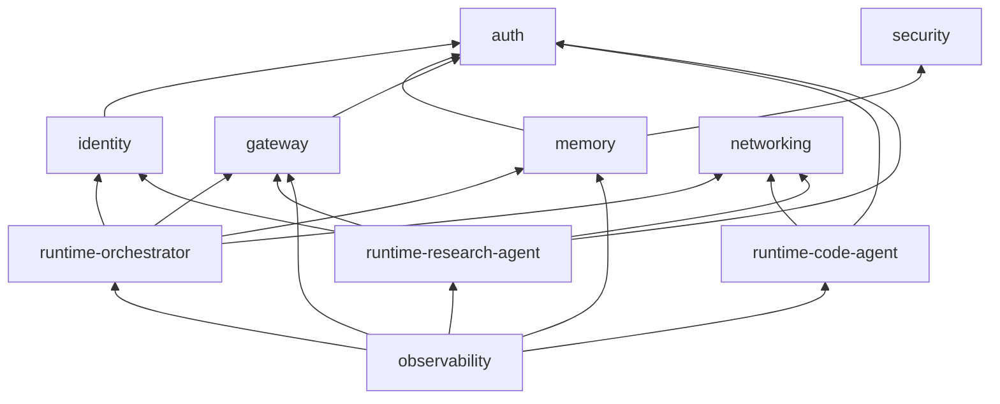

<!-- markdownlint-disable MD041 -->

# Modules

The platform is a set of CloudFormation stacks, each gated by configuration.
A "module" here is one of those stacks: a unit you can deploy, verify, and
destroy independently. Which stacks exist for a given configuration is not a
convention — it is computed by `expected_stacks()` in
`infra_utils/platform_config.py`, the deployment contract that deploy plans,
verification, the dashboard, and destroy all consume. CI synthesizes every
preset and fails if the contract and the CDK app (`app.py`) ever drift.

## The modules

| Module | Gated by | Purpose | Page |
|---|---|---|---|
| `networking` | `security.networking` / `ENABLE_NETWORKING` | Optional VPC, private subnets, endpoints, runtime security group | [networking.md](networking.md) |
| `security` | `security.cloudtrail_alerting` / `ENABLE_SECURITY` | KMS CMK for Memory encryption, CloudTrail audit trail | [security.md](security.md) |
| `auth` | always¹ | Cognito user pool, app/web/M2M clients, optional enterprise IdP federation | [auth.md](auth.md) |
| `identity` | always | AgentCore Identity: gateway M2M credential provider, 3LO OAuth providers | [identity.md](identity.md) |
| `memory` | always¹ | AgentCore Memory store (short-term; long-term opt-in) | [memory.md](memory.md) |
| `gateway` | always¹ | AgentCore MCP Gateway with Lambda tools, web search, optional Cedar + egress filter | [gateway.md](gateway.md) |
| `runtime-orchestrator` | always¹ | The selected agent pattern on AgentCore Runtime | [runtime.md](runtime.md) |
| `runtime-code-agent`, `runtime-research-agent` | `agents.a2a` / `ENABLE_A2A`² | A2A sub-agents on their own runtimes | [runtime.md](runtime.md) |
| `observability` | always | Vended logs, Transaction Search, optional traceability alerting + alarms + dashboard | [observability.md](observability.md) |

¹ "Always" within the account's federated role — see
[Federated roles](#federated-roles-trim-the-footprint) below.
² The legacy env-var default for `ENABLE_A2A` is `true`, but the
`platform.yaml` schema default for `agents.a2a` is `false` — the two paths
deliberately differ (see the comment at the top of `app.py`).

## Dependency order

The edges below are the actual `add_dependency()` calls in `app.py`
(an arrow reads "depends on"). Optional stacks only contribute their edges
when they exist.

`networking` and `security` have no dependencies of their own; `observability`
deploys last, after every resource stack it monitors.

## Guided workshop modules

`scripts/deploy.sh workshop` walks the platform module by module. Its
`MODULE_MAP` maps each guided step onto the stacks above: module 3 deploys
`auth`, 4 `auth`+`identity`, 5 and 7 `gateway` (7 re-deploys it to add tool
targets), 6 and B `runtime-orchestrator`, 8 the two A2A runtimes, 9
`observability`, A `memory`, C `networking`, and E `security`. Module D
(CI/CD) is guided-only and deploys no stack. Each step prints a what/why
explanation (`MODULE_EXPLAIN`), applies the feature flags its stacks need
(selecting module C without `ENABLE_NETWORKING=true` would otherwise fail
with "No stacks match"), deploys, and runs that module's verification.

## Federated roles trim the footprint

In a federated multi-account deployment, `expected_stacks(account)` decides
the footprint by role. A **platform** account gets the shared services —
`auth`, `identity`, `gateway`, plus any enabled `networking`/`security` and
`observability` — but no agent runtimes and no memory. A **workload** account
gets the runtimes, its own `memory`, and its own `identity` (token vaults are
account-local, so it holds the platform M2M credentials in its own provider),
but no `auth` and no `gateway` — it consumes the platform account's via pure
OAuth. The same `platform.yaml` deploys both sides; the account you deploy
into decides the role. See [Multi-account federation](../MULTI_ACCOUNT.md).
